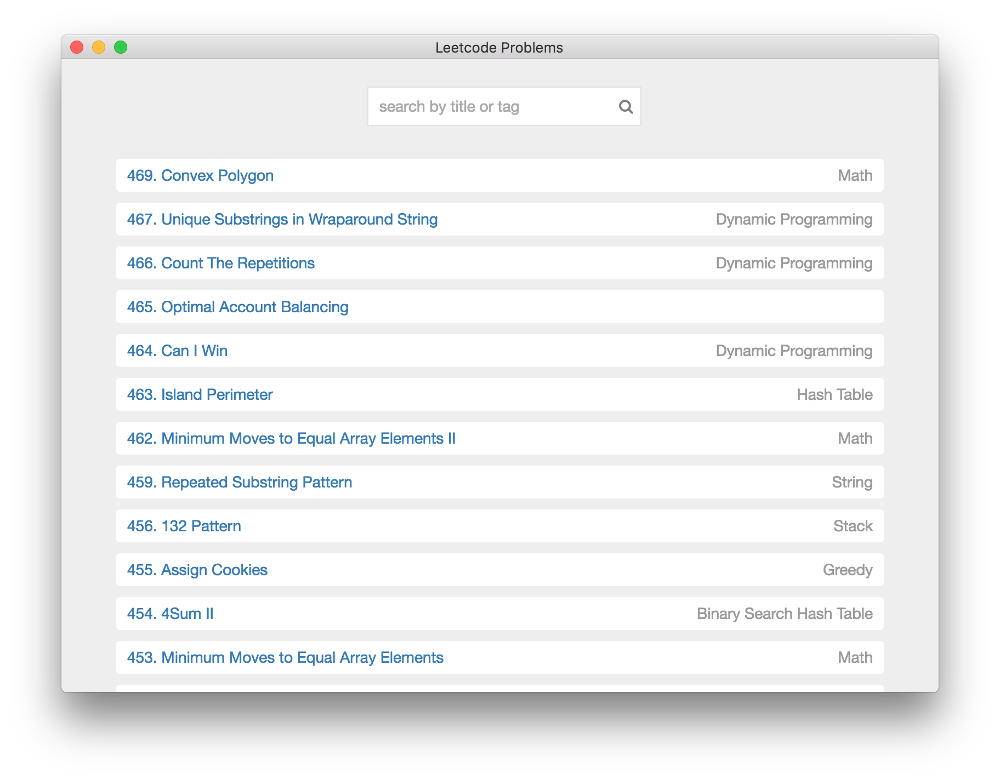
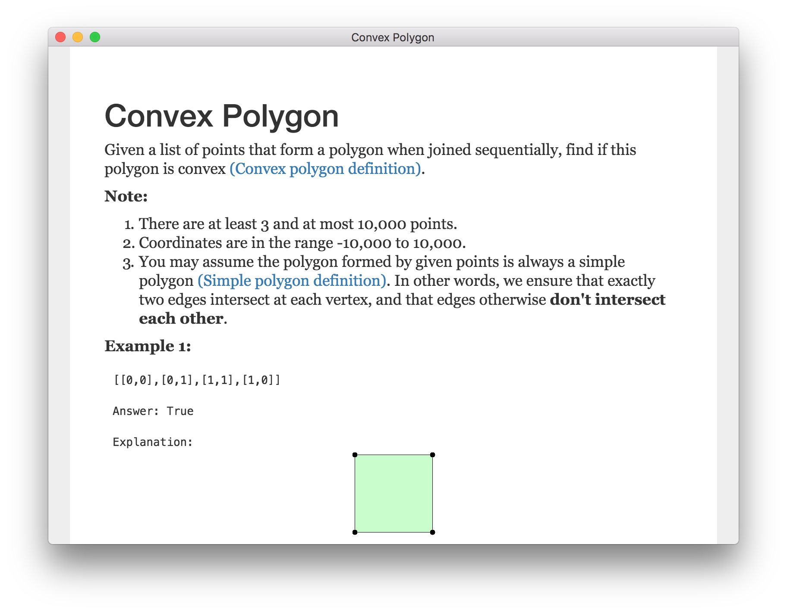
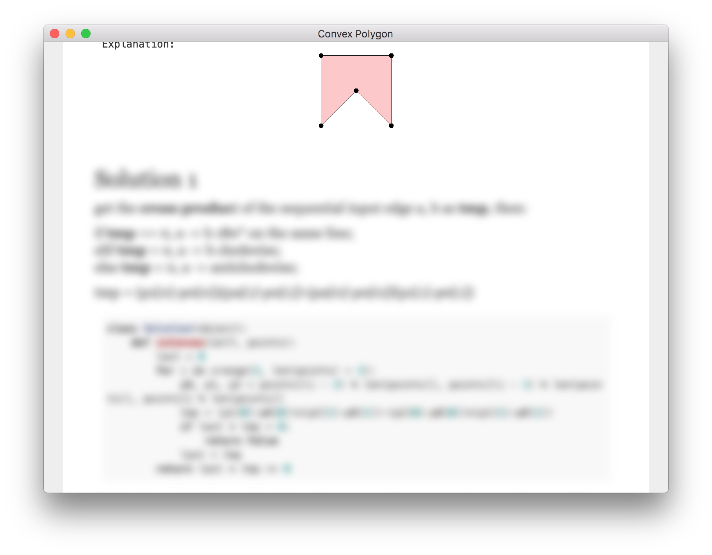
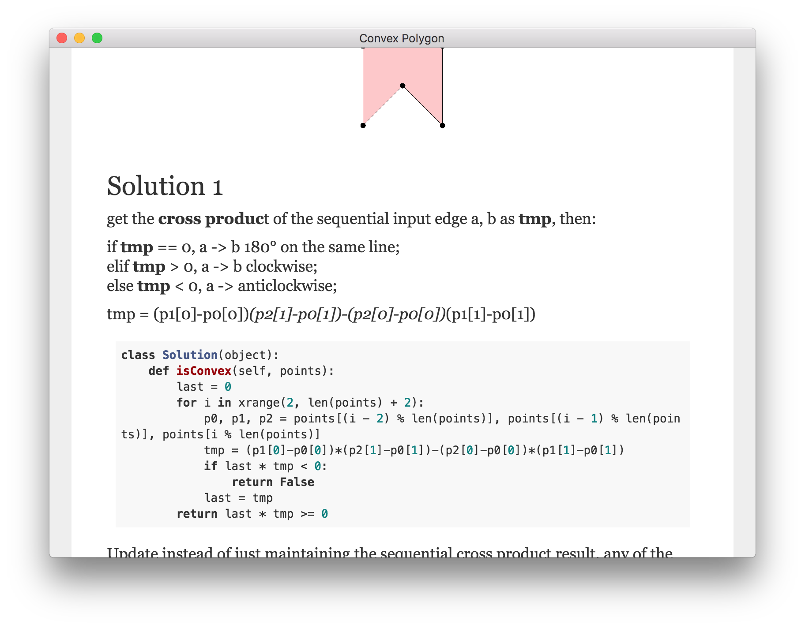

# Leetcode Best Answers

**Note**: WIP

## Features

- List of problems from Leetcode.com

- Works offline

- Top voted posts from the discussion forum that you can refer to

- Answers are blurred so you can think for yourself without distraction

- And well formatted solutions whenever you are ready

## Run

- `yarn install`
- `yarn start`

## TODO

- test cases
- feature:
  - search by number
  - filter by level
  - random problem set
- package app for different platforms

## App

There is a Mac app in `Leetcoder-darwin-x64`.

There is an iOS app with similar features: [Leetcoder](https://itunes.apple.com/us/app/leetcoder/id1069760709?mt=8).

There are generated pdf files in forum folder :)

## Feedback

Just open an issue.
